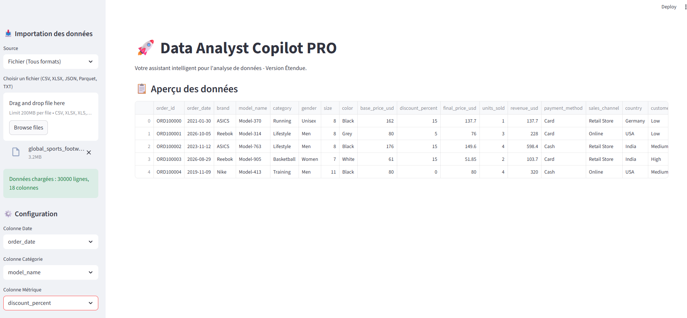
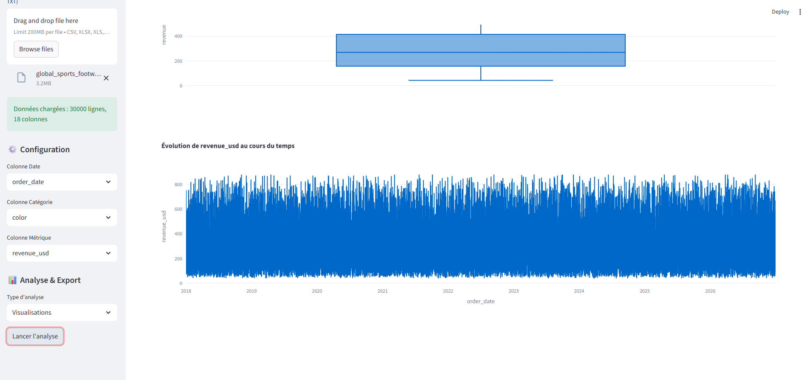
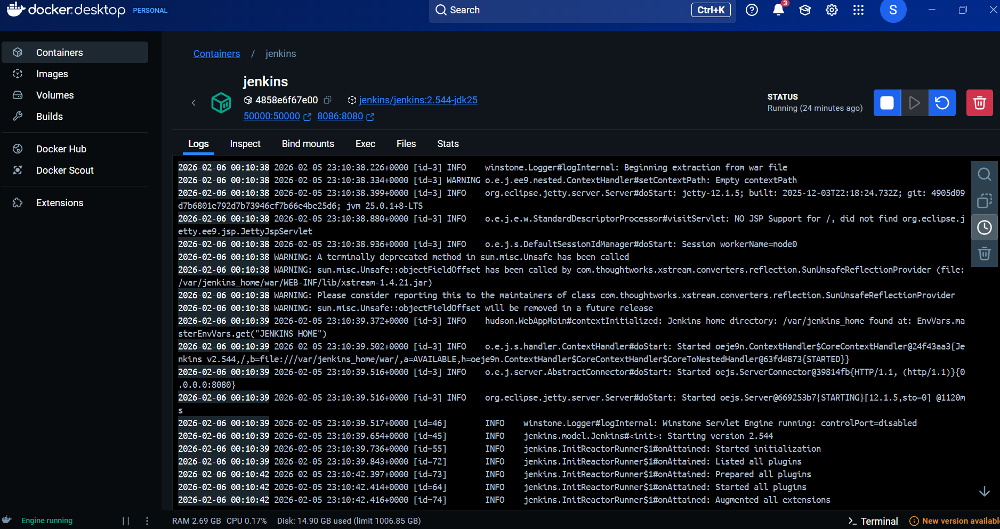

# 🚀 Data Analyst Copilot

Un **Data Analyst Copilot** développé en **Python + Streamlit**, entièrement **dockerisé** et **automatisé avec Jenkins (CI/CD)**.

👉 Le projet fonctionne **à l’identique sur Windows, macOS et Linux** grâce à Docker.

---

## 🎯 Objectif du projet

- Fournir une interface simple pour :
  - Analyser des datasets (CSV, Excel, Parquet)
  - Visualiser des données
  - Explorer des statistiques
- Garantir un déploiement reproductible sur tous les environnements
- Mettre en place une pipeline CI/CD professionnelle

---

## 🧠 Fonctionnalités

- 📊 Analyse de données (Pandas, NumPy)
- 📈 Visualisations interactives (Plotly, Streamlit)
- 📁 Import CSV / Excel / Parquet
- 🐳 Lancement en un clic avec Docker
- 🔁 Pipeline CI/CD automatisée avec Jenkins
- ✅ Smoke test automatique du container Streamlit

---

## 🖥️ Aperçu de l'application

### Interface principale


### Analyse des données


### Visualisation


### Données de simulation


---

## 🧰 Technologies utilisées

### 🔹 Data & Backend
- Python 3.11
- Pandas
- NumPy
- Scikit-learn
- PyArrow / FastParquet
- OpenPyXL

### 🔹 Frontend
- Streamlit
- Plotly
- Altair

### 🔹 DevOps & CI/CD
- Docker
- Dockerfile
- Jenkins
- Jenkins Pipeline (Declarative)
- Docker Network (tests inter-containers)
- Curl (smoke test)
- Git & GitHub



---

## 🐳 Lancer le projet avec Docker (recommandé)

### 1. Cloner le projet
```bash
git clone https://github.com/SALAHmdk/data-analyst-copilot.git
cd data-analyst-copilot

### 2. Construire l’image Docker
docker build -t data-analyst-copilot .

### 3. Lancer le container
docker run -p 8501:8501 data-analyst-copilot


### 👉 Ouvre ensuite :
http://localhost:8501

### 🔄 CI/CD avec Jenkins

### La pipeline Jenkins :

Clone le repo GitHub

Build l’image Docker

Lance le container

Vérifie la santé de l’application (/_stcore/health)

Stoppe et nettoie le container

📄 Pipeline définie dans le fichier Jenkinsfile.

### ✅ Pourquoi ce projet est portable

Aucun prérequis Python local

Aucun souci de version

Docker garantit le même comportement partout

Jenkins valide automatiquement chaque commit

### 👤 Auteur

Salah Mohand Kaci
Projet Data / DevOps – CI/CD avec Python / Docker & Jenkins
